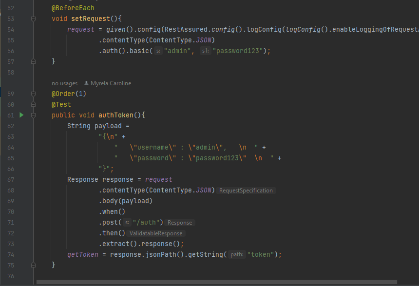

# DIO | GFT Quality Assurance Para Mulheres

 
 > Explorando o Rest Assured para automação de testes de API (Restful Booker API e Json Server)

 Projeto construído durante o Bootcamp **GFT Quality Assurance Para Mulheres** da **DIO**.

## 🔧 Ferramentas e Tecnologias

- Postman [Clique aqui para acessar a pasta](../PostmanCollection)
- JUnit
- Allure Framework
- Json Server  [Clique aqui para acessar a pasta](../JsonServer)

## 🔗 Contato

mykallella@gmail.com
